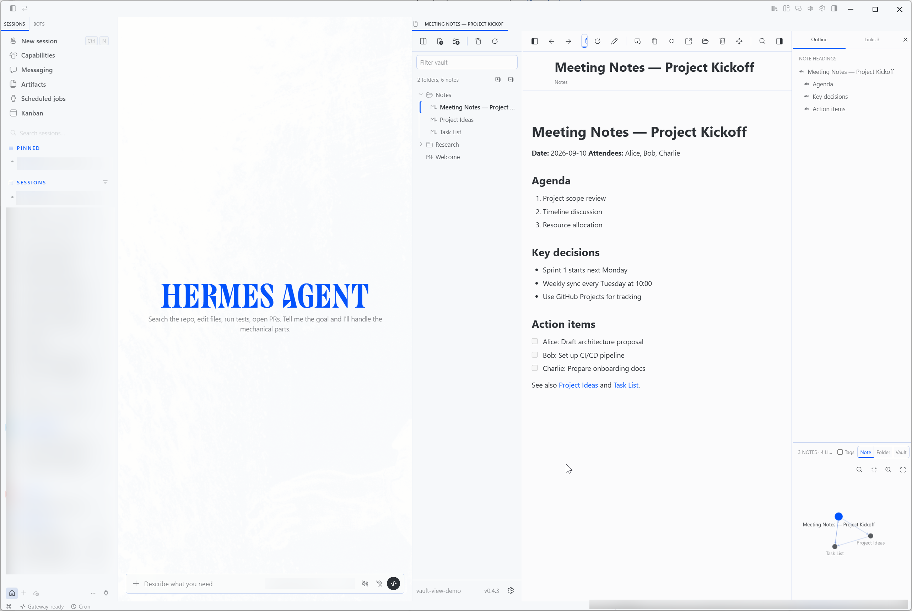
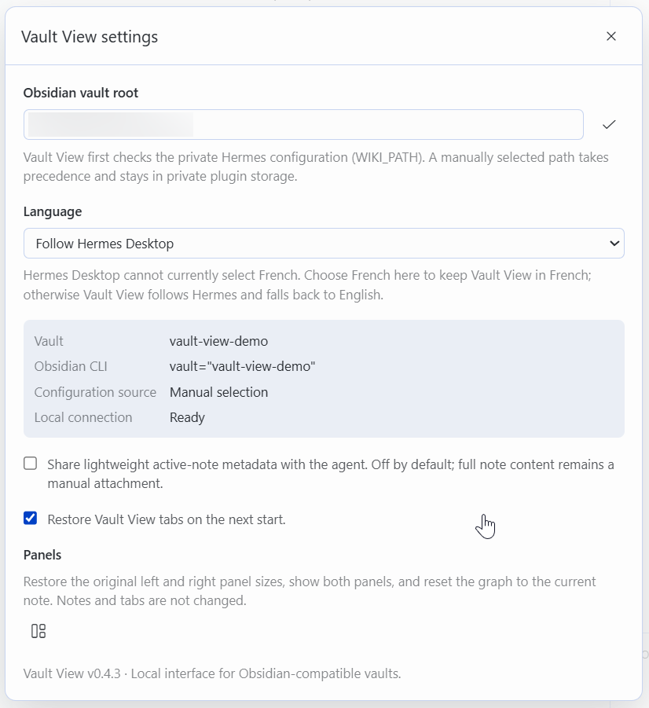

# Vault View

**Your Obsidian-compatible vault, directly inside Hermes Desktop.**

[English](README.md) · [Français](README.fr.md)

Vault View brings your Markdown knowledge base into the conversation. Find a note, ask Hermes to create or update it, follow its links, and keep several notes open in a workspace designed for a vault—not a generic file preview.

## Find. Create. Navigate.

| Search the vault | Create and edit | Explore connections |
| --- | --- | --- |
| Search notes, browse folders, filter tags, and inspect links. | Write directly or ask Hermes to work through its configured Obsidian CLI. | Follow wikilinks, use Back and Forward, open tabs, or jump through the graph. |

## Features

- Visual reading and Markdown editing
- Note and folder creation, renaming, moving, and deletion
- Search, explorer, outline, tags, backlinks, outgoing links, and vault graph
- Wikilinks, Obsidian callouts, and local images
- Multiple tabs with independent navigation history
- Automatic refresh after changes made by Hermes, Obsidian CLI, or another editor
- Light and dark Hermes theme support
- English, French, or automatic Hermes Desktop language selection
- Icon-first controls with localized labels and tooltips

## How it works with Hermes

The Hermes agent keeps using its existing Obsidian CLI integration for note operations. Vault View provides the user-facing display and replaces the generic preview for Obsidian-related work. It can show one note, open several notes at once, or stay hidden for background-only operations.

## Installation

Vault View is a standalone Hermes Desktop Plugin. It requires no build step, npm package, or Python component.

### One-click installation

Open this page on the computer running Hermes Desktop, then select **Install in Hermes Desktop**:

[**Install Vault View in Hermes Desktop**](hermes://plugin/install?repo=ergocogn/hermes-desktop-plugin-vault-view)

Hermes asks for confirmation before installing. If the link is not available in your Hermes Desktop version, use the manual installation below.

### Manual installation

1. Copy this repository into the active Hermes Desktop plugin directory as `vault-view`.
2. Confirm that the entry point is `$HERMES_HOME/desktop-plugins/vault-view/plugin.js`.
3. Reload Desktop Plugins in Hermes Settings.
4. Enable **Vault View**.

Use the plugin directory shown by Hermes Desktop. The Desktop application and its backend may use different locations, especially with WSL or a virtual machine.

## Configuration

Vault View automatically looks for the vault already configured through Hermes `WIKI_PATH`. If no valid `.obsidian` vault is found, select its root in the settings panel.

The language setting offers **Follow Hermes Desktop**, **English**, and **Français**. The same panel controls tab restoration, panel layout, and optional active-note metadata sharing.

## Privacy

- Vault files stay on the configured local filesystem.
- No token, credential, personal path, or vault content is embedded in the plugin.
- Full note content is never attached to the agent automatically.
- Optional active-note sharing is disabled by default and sends only lightweight metadata.
- The vault path remains in Vault View's private local plugin storage.

The screenshots use a synthetic demonstration vault. They contain no personal path, private conversation, or real note content, and their PNG metadata has been removed.

## Compatibility

- Hermes Desktop with Desktop Plugin support
- A local Markdown vault compatible with Obsidian
- Windows, macOS, or Linux, provided the active Hermes backend can access the vault

## Support and contributions

Use [GitHub Issues](https://github.com/ergocogn/hermes-desktop-plugin-vault-view/issues) for support, bugs, and feature requests. See [CONTRIBUTING.md](CONTRIBUTING.md), [SUPPORT.md](SUPPORT.md), and [SECURITY.md](SECURITY.md) before sharing logs or screenshots.

## Independent project

Vault View is an independent community project by ergoCogn sàrl. It is not affiliated with, sponsored by, or endorsed by Dynalist Inc., the maker of Obsidian, or by Nous Research, the maintainer of Hermes. Product names are used only to describe compatibility.

## License

[MIT](LICENSE) © 2026 ergoCogn sàrl
